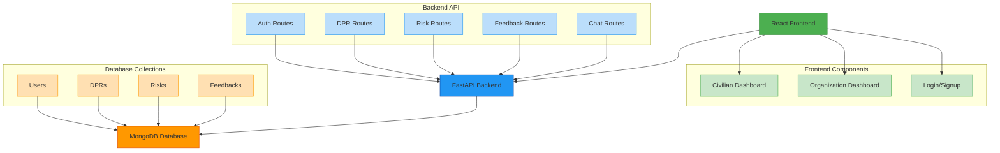

```mermaid
graph TD
    A[React Frontend] --> B[FastAPI Backend]
    B --> C[MongoDB Database]
    
    subgraph Frontend Components
        A1[Civilian Dashboard]
        A2[Organization Dashboard]
        A3[Login/Signup]
    end
    
    subgraph Backend API
        B1[Auth Routes]
        B2[DPR Routes]
        B3[Risk Routes]
        B4[Feedback Routes]
        B5[Chat Routes]
    end
    
    subgraph Database Collections
        C1[Users]
        C2[DPRs]
        C3[Risks]
        C4[Feedbacks]
    end
    
    A --> A1 & A2 & A3
    B1 & B2 & B3 & B4 & B5 --> B
    C1 & C2 & C3 & C4 --> C
    
    style A fill:#4CAF50,stroke:#388E3C
    style B fill:#2196F3,stroke:#0D47A1
    style C fill:#FF9800,stroke:#E65100
    
    style A1 fill:#C8E6C9,stroke:#4CAF50
    style A2 fill:#C8E6C9,stroke:#4CAF50
    style A3 fill:#C8E6C9,stroke:#4CAF50
    
    style B1 fill:#BBDEFB,stroke:#2196F3
    style B2 fill:#BBDEFB,stroke:#2196F3
    style B3 fill:#BBDEFB,stroke:#2196F3
    style B4 fill:#BBDEFB,stroke:#2196F3
    style B5 fill:#BBDEFB,stroke:#2196F3
    
    style C1 fill:#FFE0B2,stroke:#FF9800
    style C2 fill:#FFE0B2,stroke:#FF9800
    style C3 fill:#FFE0B2,stroke:#FF9800
    style C4 fill:#FFE0B2,stroke:#FF9800
```